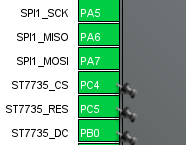

## Prueba de pantalla TFT ST7735S

La placa **STM32F407VG** se conecta mediante la interfaz serial **SPI1** a una pantalla TFT de **128x128 píxeles** basada en el controlador **ST7735S**.

---

## Conexión de pantalla

<p align="center">
  
  &nbsp;&nbsp;&nbsp;&nbsp;
  
</p>

### Tabla de conexiones

| STM32F407VG        | Pantalla TFT ST7735S |
|--------------------|-----------------------|
| SPI1_CLK  `[PA5]`  | SCK                   |
| SPI1_MOSI `[PA7]`  | SDA                   |
| SPI1_MISO `[PA6]`  | A0                    |
| ST7735S_CS `[PC4]` | CS                    |
| ST7735S_RESET `[PC5]` | RESET              |

> ⚠️ **Nota:** Verificar la configuración de pines en el archivo `.ioc` del proyecto, utilizando **STM32CubeMX**.

---

## Compilación y carga del programa

### Requisitos

Asegúrate de tener instalados los siguientes programas:

- `make`
- `arm-none-eabi-gcc`
- `openocd` (para la carga del programa)

### Compilar el proyecto

```bash
make
```
### Cargar el programa
```bash
    ./run.sh
``` 

### Pantalla funcionando

<p align="center">

</p>